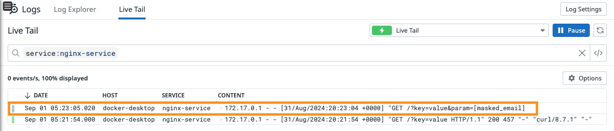
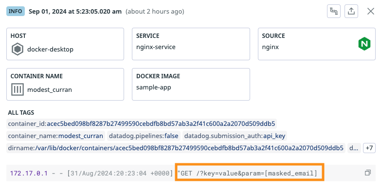

# datadog-logs-sandbox

This is a sandbox project for collecting logging using datadog agent in Docker

The sandbox architecture is like this:

```
+------+    +---------------+    +----------------+
| apps | -> | datadog agent | -> | datadog server |
+------+    +---------------+    +----------------+
(docker)         (docker)             (saas)
```


## Datadog Agent

Datadog Agent 6+ collects logs from containers.

At first, get DD_API_KEY in your [datadog service](https://app.datadoghq.com/) and set it to `<DD_API_KEY>` in `dd-agent/run-macos.sh`

> dd-agent/run-macos.sh
```bash
DD_API_KEY="<DD_API_KEY>"
```


Then, run `dd-agent/run-macos.sh` which run a Docker container that embeds the Datadog Agent to monitor your host

```bash
dd-agent/run-macos.sh

docker run -d --name datadog-agent \
    --cgroupns host \
    --pid host \
    -e DD_API_KEY=${DD_API_KEY} \
    -e DD_LOGS_ENABLED=true \
    -e DD_LOGS_CONFIG_CONTAINER_COLLECT_ALL=true \
    -e DD_LOGS_CONFIG_DOCKER_CONTAINER_USE_FILE=true \
    -e DD_CONTAINER_EXCLUDE="name:datadog-agent" \
    -e DD_SITE=${DD_SITE} \
    -v /var/run/docker.sock:/var/run/docker.sock:ro \
    -v /var/lib/docker/containers:/var/lib/docker/containers:ro \
    -v /opt/datadog-agent/run:/opt/datadog-agent/run:rw \
    gcr.io/datadoghq/agent:latest
```

Check if the container runs as expected like this: 

```bash
# Check if a docker process runs
docker ps 

# Open a shell inside a running container
docker exec -it datadog-agent bash

# See enviroments 
root@084bcbcb0ede:/# set |grep DD
DD_API_KEY=********************
DD_CONTAINER_EXCLUDE=name:datadog-agent
DD_GIT_COMMIT_SHA=06c00f7ed4992694cd8340ff3581c0af73799bec
DD_GIT_REPOSITORY_URL=https://github.com/DataDog/datadog-agent
DD_LOGS_CONFIG_CONTAINER_COLLECT_ALL=true
DD_LOGS_CONFIG_DOCKER_CONTAINER_USE_FILE=true
DD_LOGS_ENABLED=true
DD_PYTHON_VERSION=3
DD_SECRET_BACKEND_COMMAND_ALLOW_GROUP_EXEC_PERM=true
DD_SITE=datadoghq.com
DOCKER_DD_AGENT=true
```

## Applications to monitor (logs)

### NGINX

Set labels for datadog in `Dockerfile`. In this case, set label to mask email address. Here are sample configurations:

> apps/nginx/Dockerfile
```bash
## Set Labels for Datadog
##########################
# Minimum required labels
# LABEL "com.datadoghq.ad.logs"='[{"source": "nginx", "service": "nginx-service"}]'

# Credit card number masking
# LABEL "com.datadoghq.ad.logs"='[{"source": "nginx", "service": "nginx-service", "log_processing_rules": [{"type": "mask_sequences", "name": "mask_credit_cards","replace_placeholder": "[masked_credit_card]", "pattern" : "(?:4[0-9]{12}(?:[0-9]{3})?|[25][1-7][0-9]{14}|6(?:011|5[0-9][0-9])[0-9]{12}|3[47][0-9]{13}|3(?:0[0-5]|[68][0-9])[0-9]{11}|(?:2131|1800|35\\d{3})\\d{11})" }]}]'

# Email address masking
LABEL "com.datadoghq.ad.logs"='[{"source": "nginx", "service": "nginx-service", "log_processing_rules": [{"type": "mask_sequences", "name": "mask_param_email","replace_placeholder": "$1[masked_email]", "pattern" : "(param=)[^@]*@(.*)" }]}]'
##########################
```

In this case, set label to mask email address

Build and run the container like this:

```bash
cd apps/nginx

# Build the container
./build.sh

# Run the container
./run.sh
```

Send test request

```bash
curl localhost:8080/?key=value\&param=hello@example.com
```

Finally check Datadog logs explorer to see if logs are sent and email addresses are masked





### HTTPBIN

Set labels for datadog in `Dockerfile`. Here are sample configurations:

```bash
LABEL "com.datadoghq.ad.logs"='[{"source": "httpbin", "service": "httpbin-service"}]'
```

Build and run the container like this:

> apps/httpbin/Dockerfile

```bash
cd apps/nginx

# Build the container
./build.sh

# Run the container
./run.sh
```

Send test request

```bash
curl localhost:8080/get?param=hello@example.com
```


# REFERENCES

- [Collecting Docker logs via Datadog Agent](https://docs.datadoghq.com/containers/docker/log/?tab=containerinstallation)
- [NGINX Dockerfile LABEL](https://docs.datadoghq.com/ja/containers/docker/log/?tab=nginxdockerfile)
